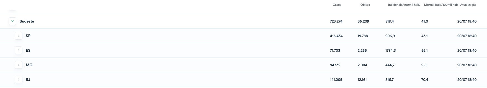

# Atividade 24/07 - Entrega até 26/07

A entrega da atividade são os commits registrados no repositório `hw06-analise-viz-dados-<github-user>` na organização `analise-viz-dados-1sem-2020`.

1. Utilizando os dados dos arquivos `obitos-confirmados-covid19-mg.csv` e `populacao-mg-2020.csv` faça um gráfico de barra com o coeficiente de mortalidade por COVID-19 por faixa etária.

Para fins do cálculo vamos utilizar a fórmula apresentada no [Painel Coronavírus](https://covid.saude.gov.br/) do Ministério da Saúde:

(Número de óbitos confirmados de COVID-19 em residentes X 100.000) / População total residente no período determinado.

Para referência, os números de 20/07 eram

# Fontes dos dados

- Óbitos confirmados por coronavírus em Minas Gerais - Posição 20/07
- Estudos populacionais FJP - Projeções populacionais municipais 2010-2040 – com população 2019 atualizada